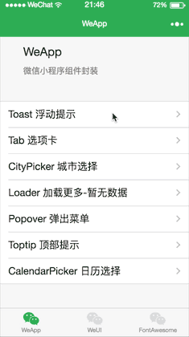
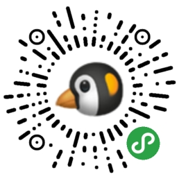
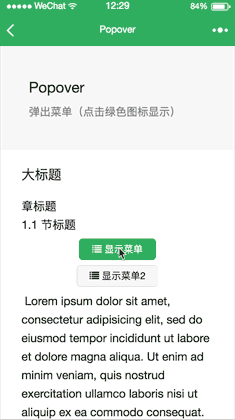
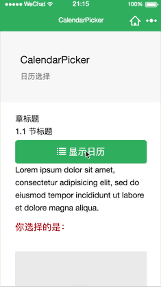

<div align="center">
  
  <br>

  <a href="javascript:;"></a>
  <a href="https://opensource.org/licenses/mit-license.php"></a>

  <p><strong>微信小程序组件和功能封装，简洁的组件化编程（持续更新中...）</strong></p>
  <h1></h1>
</div>

**旧版本v1不再维护，新版本全部基于微信的Component封装！** 组件的使用方式完全改变！[查看v1版本](https://github.com/ChanceYu/weapp/tree/v1)，[下载v1版本](https://github.com/ChanceYu/weapp/releases)

**新版本基于微信的Component自定义组件封装**，简洁的组件化编程，关于Component自定义组件参考 [Component API](https://mp.weixin.qq.com/debug/wxadoc/dev/framework/custom-component/)。

注意需要开启微信开发者工具中的ES6转ES5功能，请使用**大于`1.6.3`版本**的小程序基础库，并将微信更新到最新版本。

## 项目预览




## 主要内容
* [weapp组件，自定义封装和优化的组件](#weapp组件)
* [common.js，对公共功能函数和小程序API的封装](#公共方法)
* [第三方UI展示，方便预览查找，基本不做修改](#第三方ui库使用到)


## 目录结构
```
├─assets ---------- 静态资源文件
│  ├─images ---------- 公共图片
│  └─js -------------- 公共的JS
│     └─common ---------- 公共方法函数封装
├─components ------ 自定义组件和第三方组件
│  ├─libs ------------ 第三方库
│  └─weapp ----------- weapp组件
├─pages ----------- 页面目录
│  ├─index ----------- 首页
│  ├─libs ------------ 第三方库页面
│  └─weapp ----------- weapp组件页面
├─app.js
├─app.json
├─app.wxss
└─README.md
```


## 主要特点
* 组件调用简单
* 组件化编程开发，可配置、可扩展、可复用
* 使用ES6代码特性
* 小程序API的二次封装，如转发分享
* 公共方法的封装，如URL参数转换

## 组件使用
* 需要在使用组件的页面json配置文件中加入以下字段，配置页面中的组件引用声明`usingComponents`
```javascript
// page.json
{
  "usingComponents": {
    "weapp-toast": "/components/weapp/toast/toast",
    "weapp-tab": "/components/weapp/tab/tab"
  }
}
```
* 使用组件，引入组件模板
```html
<!-- page.wxml-->
<weapp-toast title="{{ toastTitle }}" bind:hide="onToastHide" />
<weapp-tab list="{{ list1 }}" activeIndex="{{activeIndex}}" bind:change="onTabChange" />
```

下面是展示`Tab`组件的简单使用，具体示例参考项目内部`pages/weapp/tab`中代码。其它类型组件使用基本和这种调用方式类似。

```javascript
// tab.json
{
  "navigationBarTitleText": "Tab",
  "usingComponents": {
    "weapp-tab": "/components/weapp/tab/tab"
  }
}
```
```html
<!-- tab.wxml -->
<weapp-tab list="{{ list1 }}" active-index="{{activeIndex}}" bind:change="onTabChange" />
```
```javascript
// tab.js
Page({
  data: {
    list1: ['选项1', '选项2', '选项3']
  },
  handlerSelect(){
    this.setData({
      activeIndex: 1
    });
  },
  onTabChange(event){
    console.log(event.detail.activeIndex)
  }
})
```


## weapp组件
* [Toast 浮动提示](#weapp-toast)
* [Tab 选项卡](#weapp-tab)
* [CityPicker 城市选择](#weapp-city-picker)
* [Loader 加载更多-暂无数据](#weapp-loader)
* [Popover 弹出菜单](#weapp-popover)
* [Toptip 顶部提示](#weapp-toptip)
* [CalendarPicker 日历选择](#weapp-calendar-picker)


## 公共方法
* [share 页面转发分享](#commonshare)
* [type 类型判断](#commontype)
* [param 将对象解析成url字符串](#commonparam)
* [unparam 将url字符串解析成对象](#commonunparam)
* [navigateTo 保留当前页面，跳转到应用内的某个页面](#commonnavigateto)
* [redirectTo 关闭当前页面，跳转到应用内的某个页面](#commonnavigateto)
* [switchTab 跳转到tabBar页面，并关闭其他所有非tabBar页面](#commonnavigateto)
* [reLaunch 关闭所有页面，打开到应用内的某个页面](#commonnavigateto)


---------


### weapp-toast
浮动提示，普遍在移动开发中使用的Toast组件，与小程序的showToast不同
###### 属性
- `title`提示信息
- `delay`自动关闭的延迟时间，单位毫秒，默认: `1500`
###### 事件
- `hide`关闭之后回调
###### 使用
```html
<weapp-toast title="{{ toastTitle }}" bind:hide="onToastHide" />
```


### weapp-tab
选项卡
###### 属性
- `list`选项卡标题
- `active-index`选中的索引，默认: `0`
- `class-name`主题样式，默认为空，可传入`weapp-tab`或其它自定义样式
###### 事件
- `change`切换的回调，参数`event`，其中`event.detail.activeIndex`为选中的当前索引
###### 使用
```html
<weapp-tab list="{{ list1 }}" active-index="{{activeIndex}}"  bind:change="onTabChange" />
```


### weapp-city-picker
城市选择
###### 属性
- `region`提示信息
###### 事件
- `change`切换的回调，参数`event`，其中`event.detail.region`为选择的区域信息
###### 使用
```html
<weapp-city-picker show="{{isCityPickerShow}}" bind:change="onChangeCity" />
```


### weapp-loader
加载更多、暂无数据提示，通常配合上拉数据列表使用
###### 属性
- `icon-type`小程序icon组件的type类型，默认: `search`
- `status`当前的状态，可选值: `loading`加载中、`nomore`没有更多、`empty`暂无数据，默认: `loading`
- `empty-txt`暂无数据提示文字，默认: `暂无数据`
- `loading-txt`加载中提示文字，默认: `正在加载`
- `nomore-txt`没有更多提示文字，默认: `没有更多数据了`
###### 使用
```html
<weapp-loader status="{{status}}" />
```


### weapp-popover
弹出菜单，最多12个可支持的箭头方位，满足绝大部分场景
<br><br>

###### 属性
- `list`菜单列表
- `page-selector`整个页面最外层容器的CSS的选择器，默认为`.page`
- `dir`箭头方位，可选值`tl tc tr rt rc rb bl bc br lt lc lb`，分别代表上右下左中，组合而成的12个方位
  - `tl` 对应 `top-left`
  - `tc` 对应 `top-center`
  - `tr` 对应 `top-right`
  - `rt` 对应 `right-top`
  - `rc` 对应 `right-center`
  - `rb` 对应 `right-bottom`
  - `bl` 对应 `bottom-left`
  - `bc` 对应 `bottom-center`
  - `br` 对应 `bottom-right`
  - `lt` 对应 `left-top`
  - `lc` 对应 `left-center`
  - `lb` 对应 `left-bottom`
###### 事件
- `select`选择每项的回调，参数`event`，其中`event.detail.item`为选中的当前项
- `show`显示的回调
- `hide`隐藏的回调
###### 使用
```html
<weapp-popover list="{{list}}" dir="{{dir}}" event="{{event}}" show="{{show}}" bind:select="onSelectPopover" />
```


### weapp-toptip
顶部提示
###### 属性
- `title`提示信息
- `type`提示类型，`success`成功、`error`失败、`warn`警告，默认: `default`
- `delay`自动关闭的延迟时间，单位毫秒，默认: `1500`
###### 事件
- `hide`关闭之后回调
###### 使用
```html
<weapp-toptip type="{{ type }}" title="{{ title }}" />
```


### weapp-calendar-picker
日历选择，支持多个月份滑动切换展示，左右点击切换月份，切换到今天
<br><br>

###### 属性
- `start-date`开始日期
- `end-date`结束日期
- `current-date`默认选择的日期
- `show`是否一开始就显示，默认: `false`
- `current`默认显示第几个月，从开始日期的月份为第一个月，默认: `0`
###### 事件
- `change`选中日期的回调函数，参数`event`，其中`event.detail.currentDate`为选中的当前日期
###### 使用
```html
<weapp-calendar-picker start-date="2017-07-07" end-date="2018-08-08" show="{{ isCalendarPickerShow }}" bind:change="onChangeDate" />
```


---------


### common.share
页面转发分享，除去每个页面的繁杂配置，使用起来更加简单高效，支持页面传递参数 options
###### 参数
- `title`显示的标题
- `url`转发的页面地址，默认为当前页面地址
###### 使用
```javascript
import common from '../../assets/js/common';

// common.share([title], [url])

Page({
  onShareAppMessage: common.share()
});
```


### common.type
类型判断，返回`Number`、`String`、`Boolean`、`Array`、`Object`、`Function`等类型字符串
###### 参数
- `value`任意需要判断的参数
###### 使用
```javascript
import common from '../../assets/js/common';

// common.type([value])

common.type(1);            // Number
common.type('abc');        // String
common.type(true);         // Boolean
common.type([]);           // Array
common.type({});           // Object
common.type(function(){}); // Function
common.type(/\d/);         // RegExp
common.type(new Date());   // Date
```


### common.param
将对象解析成url字符串
###### 参数
- `urlObject`参数对象，要转换成字符串参数的对象
- `unEncodeURI`不使用编码，默认使用编码`encodeURIComponent`
###### 使用
```javascript
import common from '../../assets/js/common';

// common.param([urlObject], [unEncodeURI])

let obj = {
  name: 'weapp',
  uid: 8,
  age: 24
};

let params = common.param(obj);

console.log(params); // ?name=weapp&uid=8&age=24
```


### common.unparam
将url字符串解析成对象，与`common.param`使用相反
###### 参数
- `urlString`地址，带url参数的地址
- `unDecodeURI`不使用解码，默认使用解码`decodeURIComponent`
###### 使用
```javascript
import common from '../../assets/js/common';

// common.unparam([urlString], [unDecodeURI])

let str = '?name=weapp&uid=8&age=24';

let obj = common.unparam(str);
```


### common.navigateTo
### common.redirectTo
### common.switchTab
### common.reLaunch
页面跳转，优化防止快速点击打开两个页面，支持对象形式传url参数，分别对应小程序的wx.navigateTo、wx.redirectTo、wx.switchTab、wx.reLaunch
###### 参数
- `url`页面地址
- `params`页面参数对象
###### 使用
```javascript
import common from '../../assets/js/common';

// common.navigateTo([url], [params])

Page({
  onTapElem(){
    common.navigateTo('/pages/weapp/popover/popover', {
      userid: 123,
      info: 'Hello,weapp'
    });
  }
});
```


## 第三方UI库使用到
字体图标使用FontAwesome，CSS组件样式使用WeUI

* font-awesome (4.7) <https://github.com/FortAwesome/Font-Awesome>
* weui-wxss <https://github.com/Tencent/weui-wxss>


## 项目截图


## License
[](https://opensource.org/licenses/mit-license.php) 

[MIT](https://opensource.org/licenses/MIT)，享受开源的乐趣。