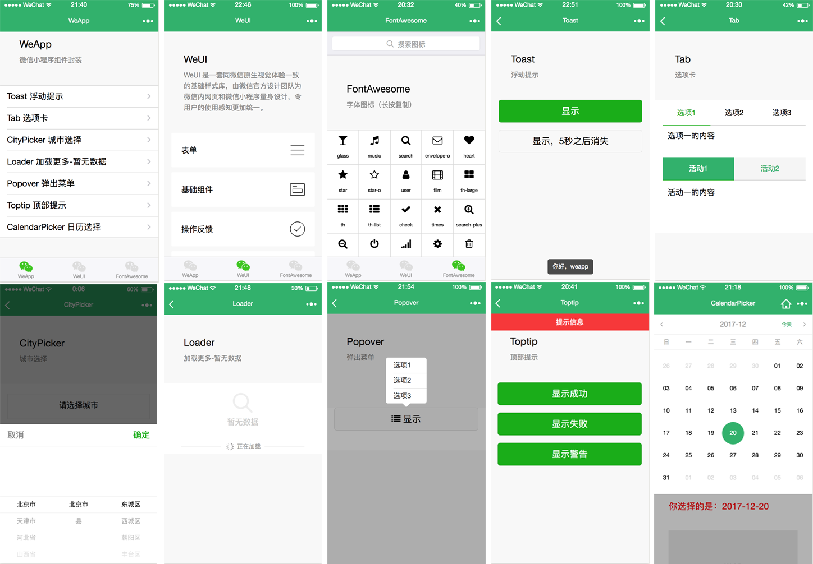

# weapp-components
**微信小程序组件封装（持续更新中...）**

此项目封装一些小程序组件，未使用到第三方框架，您可以很好的使用全部的组件或者单独集成某个组件到自己项目中。另外也对小程序的一些小功能进行了封装，方便开发使用。





## 目录结构
* `assets` ---------- 静态资源文件
  * `images` ------------ 公共图片
  * `js` ---------------- 公共的JS
* `components` ------ 自定义组件和第三方组件
  * `libs` -------------- 第三方组件
  * `weapp` ------------- weapp自定义封装的组件
* `pages` ----------- 页面目录
  * `index` ------------- 首页
  * `libs` -------------- 第三方库目录
  * `weapp` ------------- 自定义组件目录
* `README.md` ------- 项目说明


## WeAPP组件
* Toast浮动提示


## 公共方法的封装`common.js`
* [common.share 页面转发分享](#common.share-页面转发分享) 
* [common.param 将对象解析成url字符串参数](#common.param-将对象解析成url字符串参数) 
* [common.unparam 将url字符串参数解析成对象](#common.unparam-将url字符串参数解析成对象) 


##### common.share 页面转发分享
除去每个页面的繁杂配置，使用起来更加简单高效，支持页面传递参数 options
```javascript
  import common from '../../assets/js/common';

  Page({
    onShareAppMessage: common.share()
  });
```


##### common.param 将对象解析成url字符串参数
```javascript
  import common from '../../assets/js/common';

  Page({
    onLoad(){
      let obj = {
        name: 'weapp',
        uid: 8,
        age: 24
      };

      let params = common.param(obj);

      console.log(params); // ?name=weapp&uid=8&age=24
    }
  });
```


##### common.unparam 将url字符串参数解析成对象
与`common.param`使用相反
```javascript
  import common from '../../assets/js/common';

  Page({
    onLoad(){
      let str = '?name=weapp&uid=8&age=24';

      let obj = common.unparam(str);
    }
  });
```


## 第三方库目前使用到
* font-awesome (4.7) <https://github.com/FortAwesome/Font-Awesome>
* weui-wxss <https://github.com/Tencent/weui-wxss>


## License
[](https://opensource.org/licenses/mit-license.php) 